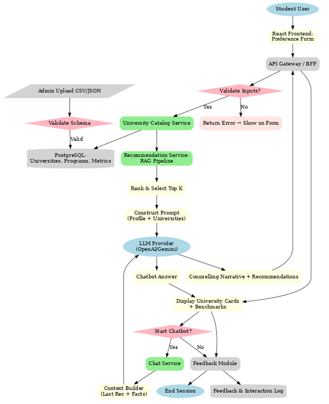

# Low-Level Design (LLD): EduPath - AI University Counsellor

## 1\. Introduction

This document outlines the low-level design for **EduPath**, an AI-powered web application designed to provide personalized university recommendations to 12th-grade students. It details the system architecture, data flow, database schema, API specifications, and other technical aspects required for implementation.

## 2\. System Architecture

We will use a standard **Client-Server Architecture**. The system is decoupled into a frontend client (the user's browser) and a backend server that handles business logic and AI integration.

- **Frontend (Client):** A Single Page Application (SPA) built with **React (using Vite)** for a fast, responsive user interface.
- **Backend (Server):** A RESTful API server built with **Node.js and Express.js**. This stack is chosen for its speed in I/O operations and rapid development capabilities, which are ideal for a hackathon.
- **Database:** **MongoDB**, a NoSQL database, will be used to store user and university data. Its flexible schema is perfect for handling diverse and evolving data structures.
- **AI Model:** We will integrate with a third-party Large Language Model (LLM) like **Google's Gemini API** via its REST API.

## 3\. Data Flow Diagram

The following flowchart illustrates the complete user journey and the flow of data through the system.

```mermaid
graph TD
    subgraph Client-Side (React App)
        A[User visits Landing Page] --> B{Fills Multi-Step Preference Form};
        B --> C[Submit Form Data];
        C --> D[Show Loading Spinner];
        D --> E{Display AI Recommendations & University Cards};
        E --> F[User clicks on Chatbot Icon];
        F --> G{User sends message in Chat UI};
        G --> H[Display Chatbot Response];
    end

    subgraph Backend-Side (Node.js/Express API)
        C -- POST /api/recommend --> I[Receive Student Preferences];
        I --> J[Filter Universities from MongoDB];
        J --> K[Construct RAG Prompt for LLM];
        K --> L[Call External Gemini API];
        L --> M[Receive AI-Generated Text];
        M --> N[Send Formatted Response (AI text + University data)];

        G -- POST /api/chat --> O[Receive Chat Message];
        O --> P[Construct Chat Prompt for LLM];
        P --> Q[Call External Gemini API];
        Q --> R[Receive AI Chat Response];
        R --> S[Send Chat Response];
    end

    subgraph External Services
        L --> T[Gemini API];
        Q --> T;
    end

    subgraph Database
        U[MongoDB Atlas]
        J -- Query --> U;
    end

    N --> E;
    S --> H;
```



## 4\. Database Schema

We will use two main collections in our MongoDB database.

### 4.1 `users` Collection

Stores student profile information and credentials.

```json
{
  "_id": "ObjectId",
  "name": "String",
  "email": "String (unique, indexed)",
  "password": "String (hashed)",
  "profile": {
    "academics": {
      "board": "String (e.g., CBSE, ISC)",
      "grade12Score": "Number",
      "entranceExams": [
        {
          "name": "String (e.g., JEE, NEET)",
          "score": "Number"
        }
      ]
    },
    "interests": {
      "fieldOfStudy": "String",
      "courses": ["String"],
      "extracurriculars": ["String"]
    },
    "preferences": {
      "locations": ["String"],
      "budget": "Number",
      "universityType": ["String"],
      "priorities": ["String"]
    }
  },
  "createdAt": "Timestamp",
  "updatedAt": "Timestamp"
}
```

### 4.2 `universities` Collection

Stores detailed information for each university. This data will be pre-seeded for the hackathon.

```json
{
  "_id": "ObjectId",
  "name": "String (indexed)",
  "location": {
    "city": "String",
    "state": "String"
  },
  "courses": [
    {
      "name": "String",
      "field": "String (e.g., Engineering, Arts)",
      "annualFee": "Number"
    }
  ],
  "benchmarks": {
    "placementPercentage": "Number",
    "averageSalary": "Number",
    "ranking": "Number"
  },
  "type": "String (e.g., research-focused, academics-focused)",
  "keyFeatures": ["String"],
  "campusInfo": {
    "description": "String",
    "imageUrl": "String"
  },
  "createdAt": "Timestamp"
}
```

## 5\. API Design (Endpoints)

The backend will expose the following RESTful API endpoints.

### 5.1 Authentication Endpoints

- **`POST /api/auth/register`**
  - **Description:** Registers a new user.
  - **Request Body:** `{ "name": "...", "email": "...", "password": "..." }`
  - **Response (201 Created):** `{ "token": "JWT_TOKEN" }`
  - **Response (400 Bad Request):** `{ "error": "User already exists" }`
- **`POST /api/auth/login`**
  - **Description:** Logs in an existing user.
  - **Request Body:** `{ "email": "...", "password": "..." }`
  - **Response (200 OK):** `{ "token": "JWT_TOKEN" }`
  - **Response (401 Unauthorized):** `{ "error": "Invalid credentials" }`

### 5.2 Recommendation Endpoint

- **`POST /api/recommend`**
  - **Description:** The core endpoint that takes user preferences and returns AI-powered recommendations.
  - **Authorization:** Requires JWT Bearer Token.
  - **Request Body:** The user's `profile` object (see `users` schema).
  - **Response (200 OK):**
    ```json
    {
      "aiCounsellorNote": "String (The personalized text from the LLM)",
      "recommendedUniversities": [
        // Array of university objects from the 'universities' collection
      ]
    }
    ```
  - **Response (500 Internal Server Error):** `{ "error": "Failed to fetch recommendations" }`

### 5.3 Chatbot Endpoint

- **`POST /api/chat`**
  - **Description:** Handles a single message in the conversation with the AI chatbot.
  - **Authorization:** Requires JWT Bearer Token.
  - **Request Body:**
    ```json
    {
      "message": "String (User's question)",
      "context": {
        // Optional: previous conversation history or recommended universities
        "recommendedUniversities": [
          /* ... */
        ]
      }
    }
    ```
  - **Response (200 OK):** `{ "reply": "String (The AI's response)" }`
  - **Response (500 Internal Server Error):** `{ "error": "Failed to get chat response" }`

## 6\. AI Integration (RAG Framework)

We will use the **Retrieval-Augmented Generation (RAG)** pattern to ensure the LLM provides accurate and relevant recommendations.

1.  **Retrieval:** When the `/api/recommend` endpoint is hit, the backend first queries the `universities` collection in MongoDB to retrieve the top 5-10 universities that match the user's hard constraints (e.g., location, budget, field of study).
2.  **Augmentation:** The retrieved university data is then structured and injected directly into a detailed prompt.
3.  **Generation:** The augmented prompt is sent to the Gemini API.

### Example LLM Prompt (`/api/recommend`)

```text
System Role: You are an expert, empathetic, and encouraging student counsellor. Your goal is to help a 12th-grade student feel confident and excited about their future.

User Profile:
- Academics: { "grade12Score": 88, "board": "CBSE" }
- Interests: { "fieldOfStudy": "Engineering", "courses": ["Computer Science"] }
- Preferences: { "locations": ["Chandigarh"], "budget": 200000, "priorities": ["Placements", "Faculty"] }

Retrieved University Data:
Here are the top 3 universities from our database that match the student's core preferences:
1.  **Punjab Engineering College**: { "placementPercentage": 92, "averageSalary": 1200000, "annualFee": 200000, "keyFeatures": ["Strong alumni network", "Legacy institution"] }
2.  **Chandigarh University**: { "placementPercentage": 85, "averageSalary": 800000, "annualFee": 150000, "keyFeatures": ["Modern labs", "Excellent industry connections"] }
3.  ...

Task:
Write a personalized and encouraging note to the student.
1.  Start with a warm greeting.
2.  Analyze their profile and acknowledge their strengths.
3.  Based ONLY on the provided university data, recommend these universities.
4.  For each university, explain WHY it's a great fit for THIS student, directly referencing their priorities (placements, faculty) and the university's key features.
5.  Conclude with an optimistic and empowering statement about their bright future.
```

## 7\. Authentication

Authentication will be handled using **JSON Web Tokens (JWT)**.

1.  Upon successful login/registration, the server generates a JWT containing the `userId`.
2.  This token is sent to the client.
3.  The client stores the token (e.g., in `localStorage`) and includes it in the `Authorization` header for all subsequent protected API requests (e.g., `Authorization: Bearer <token>`).
4.  A middleware on the backend will verify the token for protected routes.

## 8\. Deployment Strategy

For a hackathon, we will prioritize speed and ease of deployment.

- **Frontend (React):** Deployed on **Vercel**. Vercel offers seamless integration with GitHub repositories for continuous deployment.
- **Backend (Node.js):** Deployed on **Render**. Render's free tier is sufficient for a hackathon and provides an easy way to deploy Node.js applications and MongoDB databases.
- **Database (MongoDB):** Hosted on **MongoDB Atlas** using their free M0 cluster.
